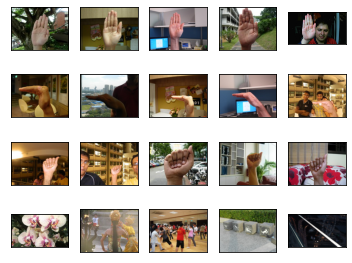

# 🎶 Hand Music Changer ✋👈✊

Hand Music Changer is a tool for changing the music with your hands trough your camera. It uses a CNN to detect your hand and change the music.

- [🎶 Hand Music Changer ✋👈✊](#-hand-music-changer-)
  - [How is it made?](#how-is-it-made)
    - [Dataset](#dataset)
  - [How to use it?](#how-to-use-it)
    - [Hide/Show GUI](#hideshow-gui)
  - [Hand signs](#hand-signs)
  - [Configuration](#configuration)
    - [Tolerances](#tolerances)
    - [Selected camera](#selected-camera)
    - [Time gap](#time-gap)
  - [Build an executable](#build-an-executable)

## How is it made?

The CNN trained for the app model is based on [MobileNetv2](https://keras.io/api/applications/mobilenet/) from Keras. This approach allows us to transfer its learning for our purposes. You can check out the [notebook](hmc.ipynb) for more information and technical details.

### Dataset

The model uses three hand gestures from the [dataset](./assets/HandsPosturev5.zip) and another class of random images for the negative samples. The gestures used are shown below:

<p align="center">
  
</p>

## How to use it?

You must use **Python 3** for the entire project.

There are a lot of requirements to use it due to there is no executable file created yet. Those requierements can be installed with pip as follows:

```shell
python -m pip install imutils keyboard numpy opencv-python pillow pyautogui tensorflow
```

Or just install the [requirements.txt](./hmc/requirements.txt) file.

```shell
python -m pip install -r requirements.txt
```

Then, execute the following command to start [the app](./hmc/hmc.py):

```shell
python ./hmc.py
```

Notice that the app depends on several files located at [./hmc/](./hmc/). So, you must make sure that those files are in the same directory as the app.

### Hide/Show GUI

There is a button to hide the camera feed. You must use `Ctrl+Alt+Shift+D` to show/hide the GUI. So it will not distract you.

## Hand signs

|         Play/Pause ✋         |     Next song 👈      |     Previous song ✊      |
| :--------------------------: | :------------------: | :----------------------: |
|  |  |  |

It is worth say that it does not matter if you flip the gesture, it will work because of the data augmentation during training.

## Configuration

Certainly there are a variety of environments to use the app. That is why there are some configuration options.

<p align="center">
  
</p>

### Tolerances

You can adjust the tolerances and the time gap to make the app more accurate. For instance, if `play/pause` does not work properly, you can try decreasing the tolerance for this hand sign, so it will be triggered with less confidence score. But, if the app suddenly changes or pauses the song you should increase the required confidence score to trigger the action.

### Selected camera

You are able to change the camera that is used to capture the video. The default camera is the first one. With this option you can use other camera for other purposes and other one dedicated to the app.

### Time gap

Finally, you can change the time between actions. This is useful whether you want to trigger the action too often or not.

## Build an executable

It is a official release coming soon. Meanwhile you can create an executable using [pyinstaller](https://pyinstaller.org/en/stable/). The [specs](./hmc/HandMusicChanger.spec) are already defined, just execute the following command:

```shell
pyinstaller HandMusicChanger.spec hmc.py
```
